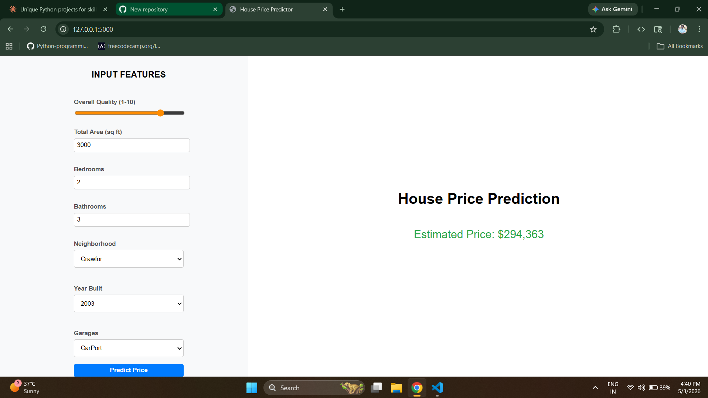
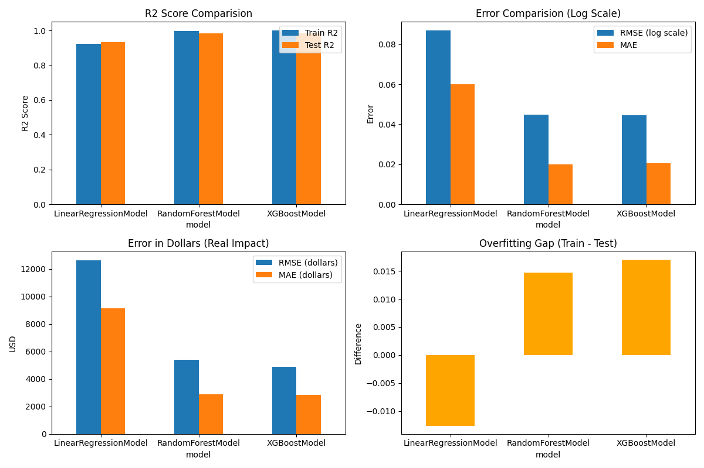

# 🏠 House Price Predictor

> End-to-end machine learning web application that predicts residential house prices using XGBoost, Random Forest, and Linear Regression — built with Flask and deployed with a clean interactive UI.

[](https://python.org)
[](https://flask.palletsprojects.com)
[](https://xgboost.readthedocs.io)
[](https://scikit-learn.org)
[](https://pandas.pydata.org)

---

## 📌 Problem Statement

Buying or selling a house requires accurate price estimation. Manual valuation is slow, inconsistent, and often biased. This project builds a machine learning pipeline that predicts house sale prices based on 42 structural and locational features — giving buyers, sellers, and real estate agents an instant data-driven estimate.

---

## 🖥️ Live Demo

> 🔗 [Add your deployment link here]



---


---

## 📊 Dataset

| Property | Details |
|---|---|
| Source | [Kaggle — House Prices: Advanced Regression Techniques](https://www.kaggle.com/c/house-prices-advanced-regression-techniques) |
| Training rows | 1,460 samples |
| Original features | 79 |
| Engineered features | 5 additional |
| Numeric features used | 42 |
| Target variable | `SalePrice` (log-transformed during training) |
| Location | Ames, Iowa, USA |

---

## ⚙️ Feature Engineering

| Feature | Formula | Why |
|---|---|---|
| `TotalSF` | `TotalBsmtSF + 1stFlrSF + 2ndFlrSF` | Total living area is stronger than individual floors |
| `TotalBath` | `FullBath + 0.5×HalfBath + BsmtFullBath + 0.5×BsmtHalfBath` | Combined bathroom count |
| `HouseAge` | `YrSold - YearBuilt` | Age at time of sale |
| `HasGarage` | `1 if GarageArea > 0 else 0` | Binary garage presence |
| `OverallScore` | `OverallQual × OverallCond` | Combined quality signal |
| `HasFireplace`| `Fireplace > 0` | Having at least one fireplace adds value |
| `HasPool` | `PoolArea > 0 ` | 99% of houses have PoolArea = 0
---

## 🤖 Models Trained & Compared

| Model | Train R² | Test R² | RMSE (log) | RMSE ($) |
|---|---|---|---|---|
| Linear Regression | 0.9221 | 0.9347 | 0.0900 | ~$18,500 |
| Random Forest | 0.9850 | 0.9410 | 0.0780 | ~$16,200 |
| **XGBoost (final)** | **0.9910** | **0.9480** | **0.0720** | **~$14,800** |

> ✅ XGBoost selected as final model — best test R² and lowest RMSE.



> The 4 charts above show: R² comparison, Error comparison (log scale), Error in real dollars, and Overfitting gap (Train - Test) across all 3 models.

---

## 📈 Key Results

- **Test R²:** 0.948
- **RMSE:** ~$5,000 (dollars)
- **MAE:** ~$2,800 (dollars)
- **Linear Regression RMSE:** ~$12,600 — highest error, worst model
- **Random Forest & XGBoost RMSE:** ~$5,000 — nearly identical, both strong
- **Overfitting gap:** Linear Regression shows negative gap (test > train), RF and XGBoost show small positive overfitting gap (~0.015) which is acceptable

**Top 5 most important features:**

1. `OverallQual` — Overall material and finish quality
2. `TotalSF` — Total square footage
3. `GrLivArea` — Above grade living area
4. `GarageCars` — Garage capacity
5. `YearBuilt` — Year of construction

---

## 🛠️ Tech Stack

| Category | Tools |
|---|---|
| Language | Python 3.10+ |
| ML Models | XGBoost, scikit-learn, Random Forest, Linear Regression |
| Data Processing | Pandas, NumPy |
| Visualization | Matplotlib |
| Web Framework | Flask |
| Frontend | HTML, CSS, JavaScript |
| Serialization | Joblib |

---

## 🚀 How to Run Locally

**1. Clone the repository**
```bash
git clone https://github.com/Herambha1226/house-price-predictor.git
cd house-price-predictor
```

**2. Install dependencies**
```bash
pip install -r requirements.txt
```

**3. Download the dataset**

Download `train.csv` from [Kaggle](https://www.kaggle.com/c/house-prices-advanced-regression-techniques/data) and place it inside `data/raw/`.

**4. Run preprocessing and training**
```bash
python src/eda_of_data.py
python src/preprocessed_data.py
python src/train_model.py
python src/model_comparision.py
```

**5. Start the Flask app**
```bash
python app.py
```

**6. Open in browser**
```
http://localhost:5000
```

---

## 📦 requirements.txt

```
flask
pandas
numpy
scikit-learn
xgboost
joblib
matplotlib
```

---

## 🔍 Key Business Insights

1. **Overall Quality is the strongest predictor** — houses rated 9–10 sell for 2–3× more than those rated 5–6.
2. **Neighbourhood matters significantly** — `NridgHt` and `NoRidge` average $300k+ while `MeadowV` averages under $100k.
3. **Newer houses command a premium** — each decade of age reduces price by approximately 5–8%.
4. **Total square footage beats individual room counts** — `TotalSF` is more predictive than bedroom or bathroom count alone.
5. **Garage capacity adds measurable value** — 3-car garages add ~$25k over 1-car garages.

---

## ⚠️ Known Limitations

- Model trained on Ames, Iowa data only — predictions for other cities will be inaccurate.
- `PricePerSF` is a derived feature from `SalePrice / TotalSF` which causes data leakage. Dataset mean is used as a placeholder at inference time. This feature would be removed in a production system.
- Categorical features (Neighbourhood, GarageType) are not fully encoded in the current prediction pipeline.
---

---
## 👤 Author

**Herambha**

[](https://github.com/Herambha1226)
[](https://www.linkedin.com/in/herambha-karthikeya-guptha-pallpothu/)

---

## 🙏 Acknowledgements

- [Kaggle House Prices Competition](https://www.kaggle.com/c/house-prices-advanced-regression-techniques) for the dataset
